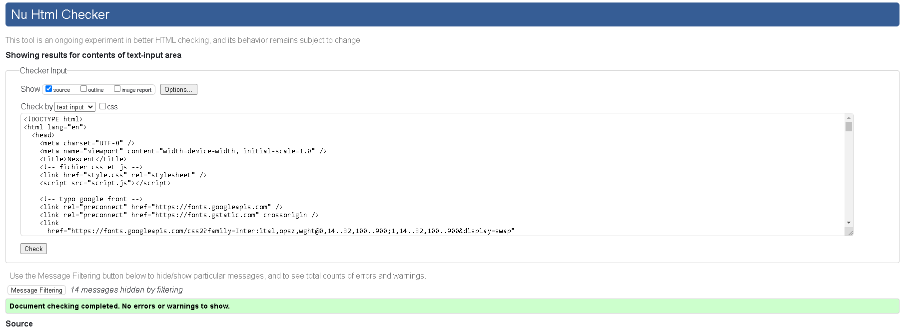
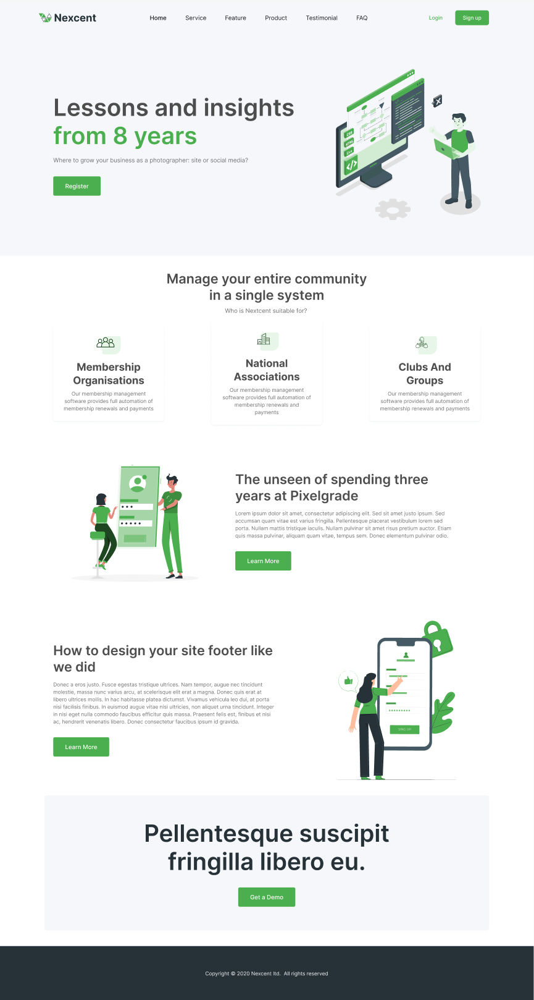

# Projet : Intégration de maquette Figma

Ce projet a été réalisé dans le cadre d'un partiel de développement web en première année à la Normandie Web School.

## Sommaire

- [Notation](#notation)
- [Aperçu](#aperçu)
- [La maquette](#la-maquette)
- [Technologies utilisées](#technologies-utilisées)
- [Licence](#licence)

## Notation

- **Respect de la maquette** (structure et design) : **/5**
- **Propreté du code** (indentation, commentaires, pas d'erreur Prettier) : **/5**
- **Utilisation des bonnes pratiques en HTML/CSS** (balises sémantiques correctes, CSS organisé, cohérence de nommage et sans trop de spécificité) : **/5**
- **Assiduité en cours et respect des consignes** : **/5**

### Points bonus :

- **Adaptation responsive bien réalisée avec une approche mobile-first** : **+1 pt**

  - _Non réalisé_

- **Votre page est déployée en ligne avec GitHub Pages** : **+1 pt**

  - https://nino-rameau.github.io/partiel-html-css/

- **Votre code est valide W3C** (les badges "infos" sont autorisés) : **+1 pt**

  
  

- **Vous avez utilisé JavaScript pour gérer** : un menu mobile, un mode _light/dark_, ou une popup qui s'ouvre au clic sur un bouton (ex. "Sign Up") : **+2 pts**
  - _En cours_

## Aperçu de la maquette

## La maquette

[Voir la maquette sur Figma](https://www.figma.com/design/u9UzdxpZINzJ2fZvh4snae/NWS---Evaluation-Integration-HTML-CSS?node-id=0-1&t=H6Ges9EuC6PUZhAe-1)

## Technologies utilisées

- Figma
- HTML
- CSS
- JavaScript

## Licence

Réalisation dans le cadre d'un projet scolaire en décembre 2024.
